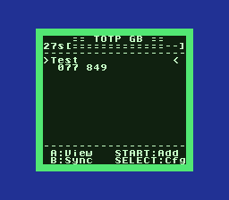
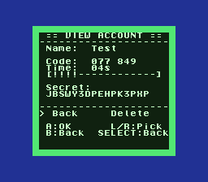
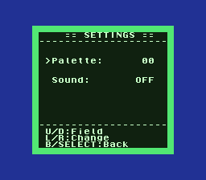
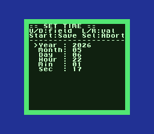
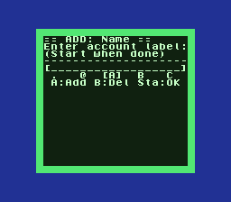

# totp-gb

A real RFC 6238 TOTP authenticator for the **Game Boy**, **Game Boy Color**,
and **Super Game Boy**. Add accounts via on-cart character dial, store them in
battery-backed SRAM, generate live 6-digit codes that roll over every 30
seconds — same protocol as Google Authenticator, Authy, etc. Pop the cart
into a real DMG and watch your phosphor-green secrets tick.

[](artifacts/)
[](https://github.com/gbdk-2020/gbdk-2020)
[](tests/)

A native **Game Boy Advance** port lives in the sibling repo
[`totp-gba`](https://github.com/dmang-dev/totp-gba) (240×160 layout, ARM7TDMI, libtonc).

---

## Screens

| | | |
|:---:|:---:|:---:|
|  |  |  |
| **Main list** — live code + 30s bar | **View account** — full secret + delete | **Settings** — palette + sound |
|  |  | |
| **Set time** — Y/M/D/h/m/s cursor | **Add account** — character dial | |

Full gallery + reproduction instructions in [`docs/screens/README.md`](docs/screens/README.md).

---

## Try it

Pre-built ROMs are checked in under [`artifacts/`](artifacts/):

| File | Target | Notes |
|---|---|---|
| `totp-gb.gb` | DMG / Pocket / Light / SGB | MBC3+TIMER+RAM+BATTERY, SGB-aware |
| `totp-gbc.gbc` | Game Boy Color, GBA compat mode, SGB | CGB-compatible, full color palettes |
| `totp-gb-test.gb` | DMG | Debug build with an auto-seeded `Test` account |

Load any of them in **mGBA**, **BGB**, or **SameBoy** and you're off. On real
hardware you'll need an MBC3+RAM+BATTERY flashcart (EZ-FLASH Junior, EverDrive
GB, or any clone).

**First boot** prompts you to set the UTC time — TOTP is computed in UTC, so
match a clock like https://www.utctime.net/ rather than your local time. After
that, **Start** adds an account (name then base32 secret), **A** views and
optionally deletes, **B** re-syncs the clock, **SELECT** opens settings, and
**L/R** cycles palettes from the main screen.

---

## Build from source

Requires **GBDK-2020** (https://github.com/gbdk-2020/gbdk-2020/releases) extracted
into `gbdk/` here, or anywhere if you set `GBDK_DIR`.

```
build.bat            # both DMG and CGB variants
build.bat dmg        # DMG only
build.bat gbc        # GBC only
build.bat test       # DMG with TEST_SEED_ON_BOOT (preloads a Hello! account)
```

Watch mode rebuilds when source changes:

```
watch.bat            # rebuilds both ROMs on save
```

---

## Features

- **HMAC-SHA1 / TOTP** per RFC 6238, ported as plain C — no GBDK deps,
  re-used verbatim by the GBA build
- **Persistent storage** for up to 8 accounts in MBC3 SRAM
- **In-cart account entry** — character dial (L/R scroll, A append, B backspace)
- **Real-time clock** via the MBC3 timer; user-settable, persisted across
  power-cycles (heartbeat-saved every 30s)
- **Multi-platform colour** — 12 GBC palettes (phosphor green, amber CRT,
  Pip-Boy, Solarized, Atari 2600, GB Camera, hot pink, ice, …) and 8 DMG
  BGP variants (normal, inverted, high-contrast, soft, dark mode, …)
- **Super Game Boy support** — phosphor-green PAL01 packet at boot plus a
  procedural deep-blue border with green accent line via SGB_CHR_TRN /
  SGB_PCT_TRN
- **GBC double-speed** mode for snappy UI on real CGB
- **Sound effects** — APU click / confirm / error / window-flip beeps,
  mute toggle in settings
- **Auto-scrolling long account names**, **urgency countdown** (`!` per
  remaining second in the last 5 of a window), **animated boot splash**

---

## Testing

The seeded test ROM (`build.bat test`) is verified end-to-end via a Lua
script that reads the live code off the BG tile map and matches it
against a 720-window precomputed table — proves the full crypto + RTC +
UI pipeline on real GB hardware:

```
.\build.bat test
mGBA -> File -> Load ROM -> artifacts\totp-gb-test.gb
mGBA -> Tools -> Scripting -> File -> Load script -> tests\verify_test_rom.lua
```

Output:
```
[ OK ] Seed string present in ROM (0x1569)
[INFO] Visible code field: '813 431'
[PASS] Displayed code 813431 matches window +120s (epoch 1778088210, T=59269607).
       Crypto pipeline + RTC + UI all verified end-to-end.
```

Full instructions in [`tests/README.md`](tests/README.md).

---

## Layout

```
src/                Pure-C sources (algorithm + GBDK platform code)
  ├ sha1.c hmac.c base32.c totp.c   crypto core (no GBDK deps)
  ├ rtc.c storage.c input.c audio.c platform glue
  ├ ui.c                            screens + widgets
  └ sgb_border.c                    procedural SGB border
artifacts/          Prebuilt ROMs (committed)
docs/screens/       Reference screenshots
tests/              Lua verifier + expected-code table
gbdk/               GBDK-2020 toolchain (vendored locally, gitignored)
build.bat           Windows build script (parallel DMG + CGB)
watch.bat           Auto-rebuild on save
```

---

## Acknowledgments

- [GBDK-2020](https://github.com/gbdk-2020/gbdk-2020) — Z80 toolchain + libgb
- [mGBA](https://mgba.io) — accurate emulator with SGB & RTC support
- [pandocs](https://gbdev.io/pandocs/) — definitive GB hardware reference
- [mcp-mgba](https://github.com/dmang-dev/mcp-mgba) — MCP server used to drive
  mGBA for the screenshot gallery and verification automation

---

## License

Released under the [MIT License](LICENSE).
